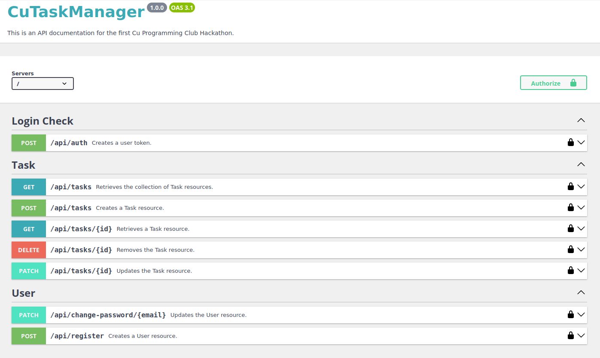
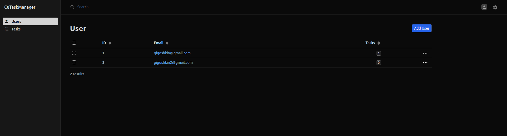

# Backend for CuTaskManager project written in PHP (Symfony)

> This is a project is for fun. It is not tested or rate limited.

## Protocol and Technical Specification
- The API architectural approach – Restful.
- The service call type – synchronous.
- The security standard for exchanging information between the parties – JSON Web Tokens (JWT)



Requirements:
- For development
  - PHP >= 8.2 with postgres
  - Docker
  - Make
- For production
  - Docker

## Deployment

To start project in development mode use:
```
composer install
docker compose up -d
php bin/console doctrine:database:create
php bin/console doctrine:migrations:migrate
```


To start project in production mode use:
```
docker compose -f compose-prod.yaml up --build -d
```

To stop the container use ``docker compose down``

Project runs at `127.0.0.1:80`

## Usage

### Authentication Method

To use the API, HTTP Basic Auth is required. To obtain access token use `/api/auth` endpoint.

**Request:** 

| Parameter | Value         |
|-----------|---------------|
| email     | User email    |
| password  | User Password |

**Response:**

| Parameter | Value                                                                         |
|-----------|-------------------------------------------------------------------------------|
| token     | JSON Web Token<br/>that needs to be included<br/>with each subsequent <br/>request |

Authentication is required for all endpoints, except `/api/register` and `/api/auth`.
Acquired JWT must be included in the request headers: `Authorization: Bearer <token>`

## Admin Panel

> Admin Panel is not secured!

Project includes EasyAdmin admin panel available at `/admin`.

